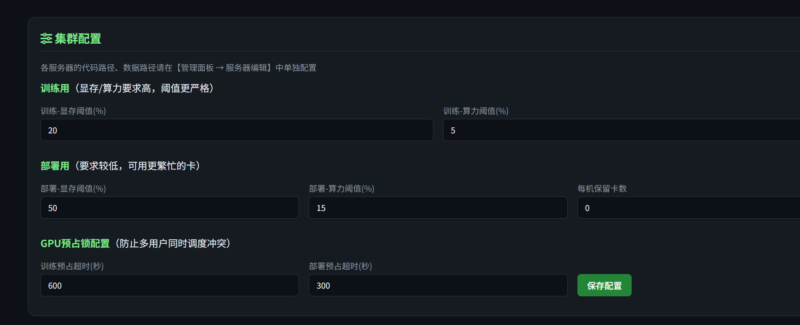
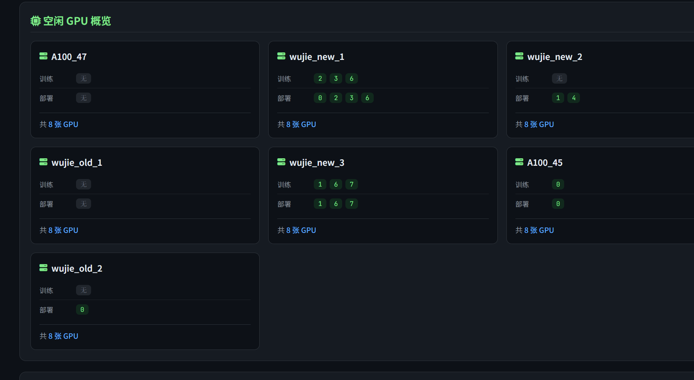
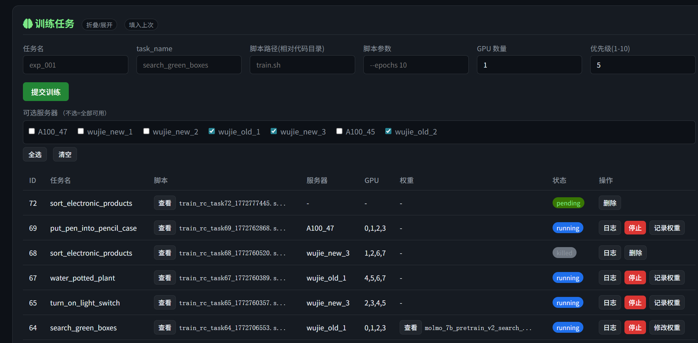
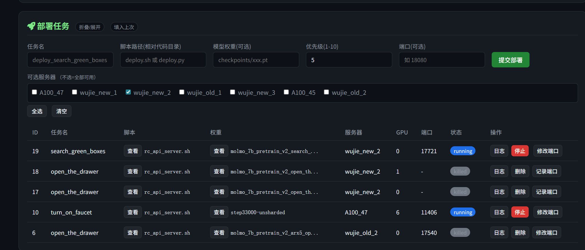
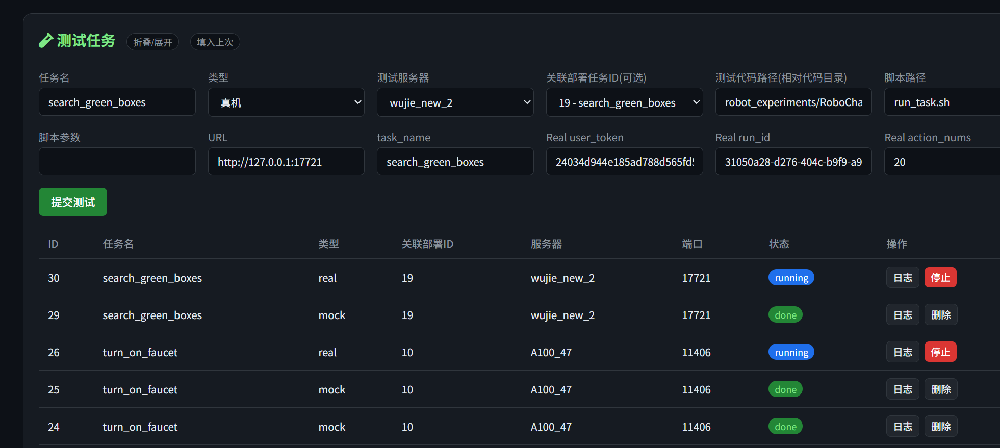

# 🚀 Cluster Management System - 集群自动化训练部署平台

[](https://www.python.org/downloads/)
[](https://flask.palletsprojects.com/)
[](LICENSE)

> **一站式集群任务调度平台** - 让多服务器训练部署像单机操作一样简单

## 🎯 核心定位

这是一个专为 **AI 训练场景** 设计的集群任务调度系统，解决多服务器环境下的资源协调难题：

- ✅ **无需手动登录每台服务器** - 统一Web界面管理所有节点
- ✅ **告别资源冲突** - 智能GPU调度，多用户并发不打架
- ✅ **一键部署训练/推理** - 自动环境配置、日志追踪、权重管理
- ✅ **可视化任务监控** - 实时查看进度、资源占用、日志输出

## ✨ 自动化特性

### 🎛️ 智能任务调度
| 功能 | 描述 | 便捷性 |
|------|------|--------|
| **训练任务** | 多GPU自动分配、任务优先级队列、脚本自动冻结 | 提交后自动排队执行 |
| **部署任务** | 模型权重自动绑定、端口自动分配、一键启动推理服务 | 无需手动配置环境 |
| **测试任务** | Mock/真机双模式、关联部署自动填充参数 | 快速验证模型效果 |

### 🔒 GPU资源协调（多用户支持）
- **TTL预占锁机制**：每个任务独立超时控制，训练任务300s、部署任务300s可配置
- **智能冲突检测**：`find_idle_server_and_gpus()` 自动过滤被占用GPU
- **自动清理僵尸锁**：后台定期清理过期锁文件

### 📦 模型权重管理
- **远程传输**：跨服务器一键复制权重文件
- **自动记录**：训练完成后自动提取 `save_folder` 路径
- **权重关联**：部署任务自动绑定训练输出的模型

### 📊 统一日志管理
- **三类日志独立存储**：
  - 训练日志：`outputs/logs/train_{task_id}_{timestamp}.log`
  - 部署日志：`outputs/logs/deploy_{task_id}_{timestamp}.log`
  - 测试日志：`outputs/logs/test_{task_id}_{timestamp}.log`
- **启动命令自动记录**：每条日志开头记录 `[LAUNCH_CMD]` 便于追溯
- **查看模式**：支持「全部」和「最近100行」两种查看方式

### 🔍 任务健康巡检
- **PID存活检测**：定期检查 `running` 任务，进程结束自动标记为 `done`
- **SSH故障恢复**：连接失败不立即标记任务失败，支持重试
- **内存报警**：GPU显存超90%自动记录警报

## 📸 界面预览

### 集群配置面板
可视化配置GPU阈值、预占锁超时等参数，支持训练/部署差异化设置


### 空闲GPU概览
实时展示各服务器GPU占用情况，绿色标签表示可用GPU编号


### 训练任务管理
提交训练任务、查看运行状态、日志追踪、权重记录


### 部署任务管理
一键部署推理服务、自动分配端口、关联训练权重


### 测试任务管理
Mock/真机双模式测试、关联部署任务自动填充参数


## 🚀 使用场景

### 场景1：多机训练
```
传统方式：
1. SSH登录 server1 → 检查GPU占用 → 手动启动训练1
2. SSH登录 server2 → 检查GPU占用 → 手动启动训练2
3. 不断检查各机状态...

本系统：
1. Web界面填写任务参数 → 点击「提交训练」
2. 系统自动排队、分配GPU、启动任务
3. 实时查看所有任务状态和日志
```

### 场景2：模型部署
```
传统方式：
1. 找到训练好的模型权重路径
2. SSH到目标服务器
3. 手动启动推理服务，记录端口
4. 手动配置测试参数

本系统：
1. 在「部署任务」选择训练任务自动填充权重路径
2. 系统自动寻找空闲GPU、分配端口、启动服务
3. 测试任务直接关联部署任务，自动填充URL和端口
```

### 场景3：多用户协作
```
传统方式：
- 用户A和用户B同时提交任务到同一台服务器
- GPU被重复分配，任务启动失败
- 需要人工协调谁先谁后

本系统：
- 每个用户独立部署本系统（独立数据库）
- 共享服务器的 `/tmp/gpu_scheduler_locks/` 实现资源协调
- TTL锁机制自动处理并发，无需人工干预
```

## 🏗️ 系统架构

```
┌─────────────────────────────────────────────────────────────┐
│                    Web管理界面 (Flask)                        │
│  ┌─────────────┐ ┌─────────────┐ ┌─────────────┐            │
│  │  训练任务   │ │  部署任务   │ │  测试任务   │            │
│  │  GPU调度    │ │  端口管理   │ │  Mock/真机  │            │
│  └─────────────┘ └─────────────┘ └─────────────┘            │
└─────────────────────────────────────────────────────────────┘
                           │
           ┌───────────────┼───────────────┐
           │               │               │
    ┌──────▼──────┐ ┌─────▼──────┐ ┌─────▼──────┐
    │  Server A   │ │  Server B  │ │  Server C  │
    │ GPU 0,1,2 │ │ GPU 0,1    │ │ GPU 0      │
    │ /tmp/lock │ │ /tmp/lock  │ │ /tmp/lock  │  ← 资源协调
    └─────────────┘ └────────────┘ └────────────┘
```

## 📋 快速开始

### 1. 安装启动
```bash
# 克隆项目
git clone https://github.com/your-repo/cluster-management.git
cd cluster-management

# 安装依赖
pip install -r requirements.txt

# 初始化数据库
python init_database.py

# 启动服务（后台运行建议用tmux）
python app.py
```

### 2. 配置服务器集群
1. 访问 `http://localhost:5000/admin/login`
2. 默认账户：`admin` / `123456`
3. 在「服务器管理」添加各GPU节点（支持密码/密钥认证）

### 3. 提交第一个训练任务
1. 进入「训练任务」面板
2. 填写：
   - 任务名：`exp_bert_base`
   - 脚本路径：`train.py`（相对于代码目录）
   - 脚本参数：`--epochs 10 --batch_size 32`
   - GPU数量：2
3. 点击「提交训练」，系统自动排队执行

### 4. 部署推理服务
1. 训练完成后，在「部署任务」关联训练任务
2. 系统自动填充权重路径
3. 设置端口（可选自动分配）
4. 点击「提交部署」

### 5. 运行测试验证
1. 在「测试任务」关联部署任务ID
2. 系统自动填充：服务器、URL、task_name
3. 选择 Mock/真机模式，填写额外参数
4. 点击「提交测试」

## ⚙️ 集群配置建议

| 配置项 | 说明 | 推荐值 |
|--------|------|--------|
| 训练预占超时 | 训练任务锁过期时间 | 300-600秒 |
| 部署预占超时 | 部署任务锁过期时间 | 300秒 |
| 训练显存阈值 | 判定GPU空闲的显存上限 | 20% |
| 部署显存阈值 | 部署任务可用更忙的卡 | 30% |
| 每机保留卡数 | 预留不分配的GPU数 | 0-1 |

## 📁 项目结构

```
server-management-panel/
├── 📄 app.py                    # 主程序 - 任务调度核心
├── 🗄️ database.py               # 数据库 - 任务/服务器/权重管理
├── 📊 cluster_utils.py          # GPU解析和空闲检测
├── 📋 requirements.txt        # Python依赖
├── 📁 templates/
│   ├── 🏠 index.html            # 用户监控面板
│   ├── ⚙️ admin.html            # 服务器管理
│   └── 🚀 cluster.html          # 【核心】训练/部署/测试面板
└── 📖 README.md                 # 本文件
```

## 🔧 核心API速览

### 任务提交
```python
POST /api/cluster/training/submit
{
  "name": "训练任务1",
  "script_path": "train.py",
  "script_args": "--lr 0.001",
  "gpu_count": 2,
  "priority": 5,
  "allowed_servers": ["server1", "server2"]
}
```

### GPU空闲查询
```python
GET /api/cluster/servers/idle-gpus
# 返回各服务器空闲GPU列表（自动过滤被锁定的卡）
```

## 🛡️ 生产环境部署建议

1. **多用户场景**：每个用户独立部署一套本系统，共享服务器的 `/tmp/gpu_scheduler_locks/` 目录实现资源协调

2. **后台运行**：
   ```bash
   tmux new -s scheduler
   python app.py
   # Ctrl+B, D 分离会话
   ```

3. **日志持久化**：
   ```bash
   # 使用nohup或systemd
   nohup python app.py >> /var/log/cluster.log 2>&1 &
   ```

4. **数据库备份**：
   ```bash
   # 定期备份 SQLite 数据库
   cp server_management.db server_management.db.backup.$(date +%Y%m%d)
   ```

## 🆘 常见问题

**Q: 任务一直显示 pending？**
- 检查服务器 `code_path` 配置是否正确
- 查看「空闲GPU概览」确认有足够GPU
- 检查日志是否有GPU锁冲突

**Q: 多个用户同时提交任务冲突？**
- 确认所有用户使用相同的 `gpu_lock_ttl` 配置
- 检查各服务器 `/tmp/gpu_scheduler_locks/` 目录权限

**Q: 训练完成但没记录权重？**
- 训练脚本需要输出 `save_folder: /path/to/weights`
- 或手动点击「记录权重」按钮

## 📜 许可证

MIT License - 详见 [LICENSE](LICENSE) 文件

---

<div align="center">

**让集群管理像单机一样简单** 🚀

</div>
